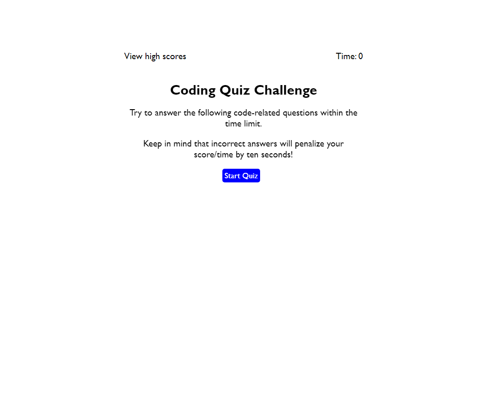
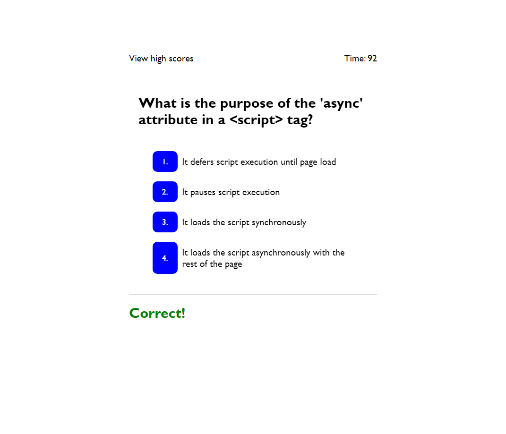
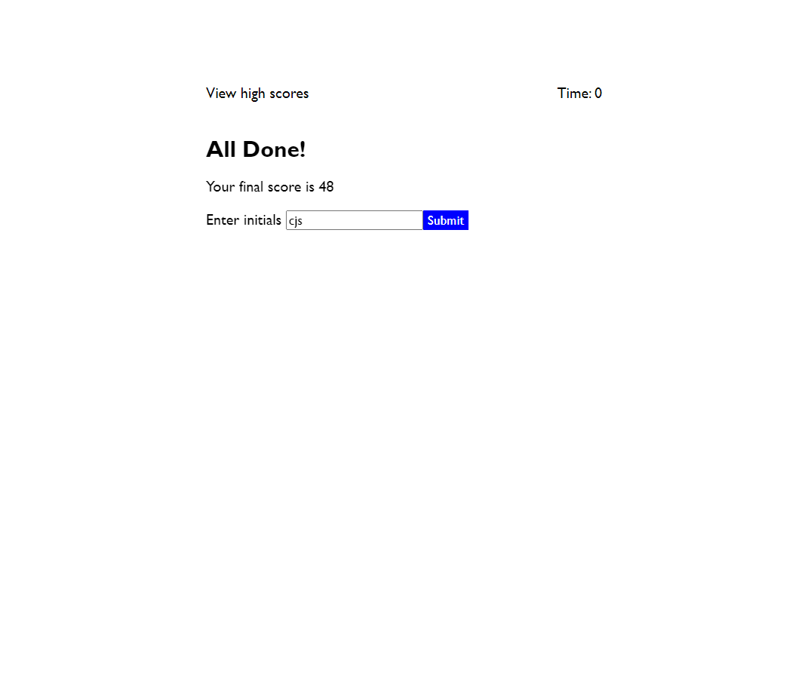
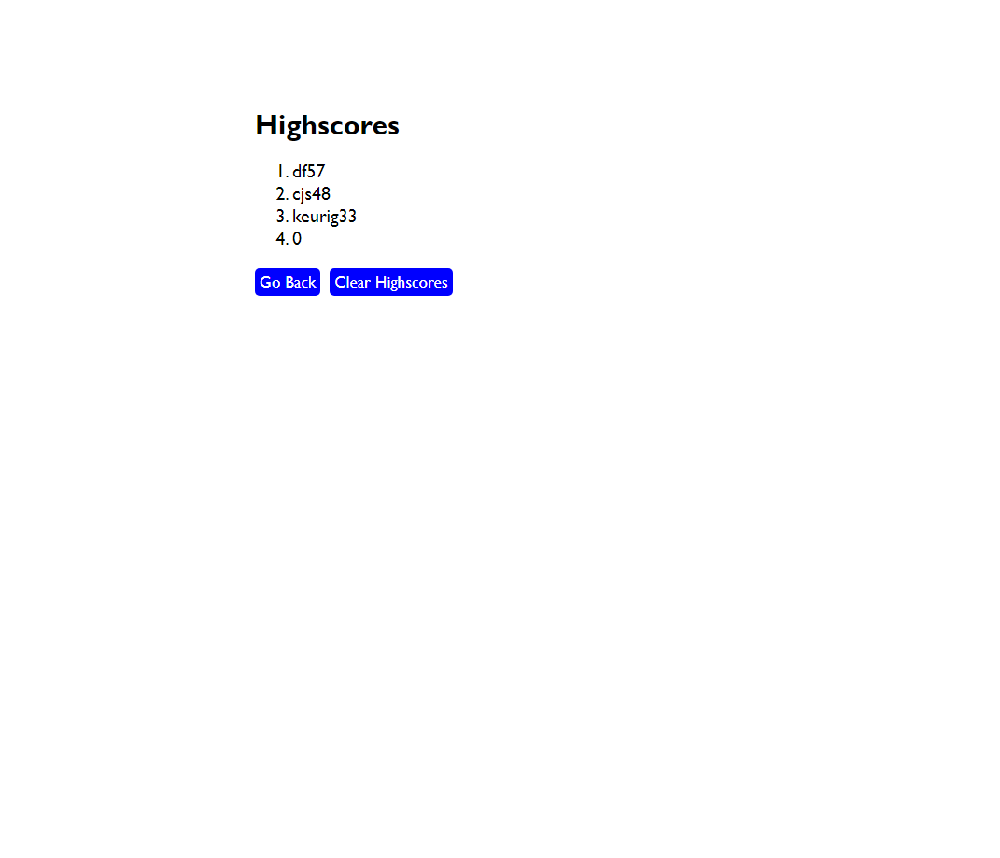

# coding_quiz

## Description 
In this project I created a quiz app to test the user on various computer programming techniques and conventions. There is a timer that starts when you start the game, and each incorrect answer results in a time penalty. Once you finish you have the ability to submit your time with your initials, and view all highscores that have been logged to the game. You have the ability to replay it as many times as you want. 

## Repository
Link to deployed code: [https://cjswayne.github.io/coding_quiz/](https://cjswayne.github.io/coding_quiz/)

## Tecbnologies
- This application used javascript, css, and html5
- It has the ability to save highscores over multiple sessions(like reloading the browser)
- the highscores are automatically sorted to display highest to lest when displayed

## Mockup

## Credits 
I used resources provided by the Rutgers University Bootcamp Course.

## Licensed 
This is under the MIT license.